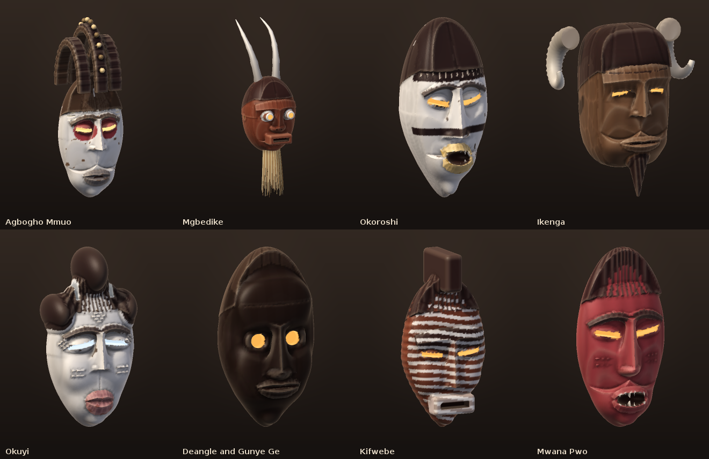
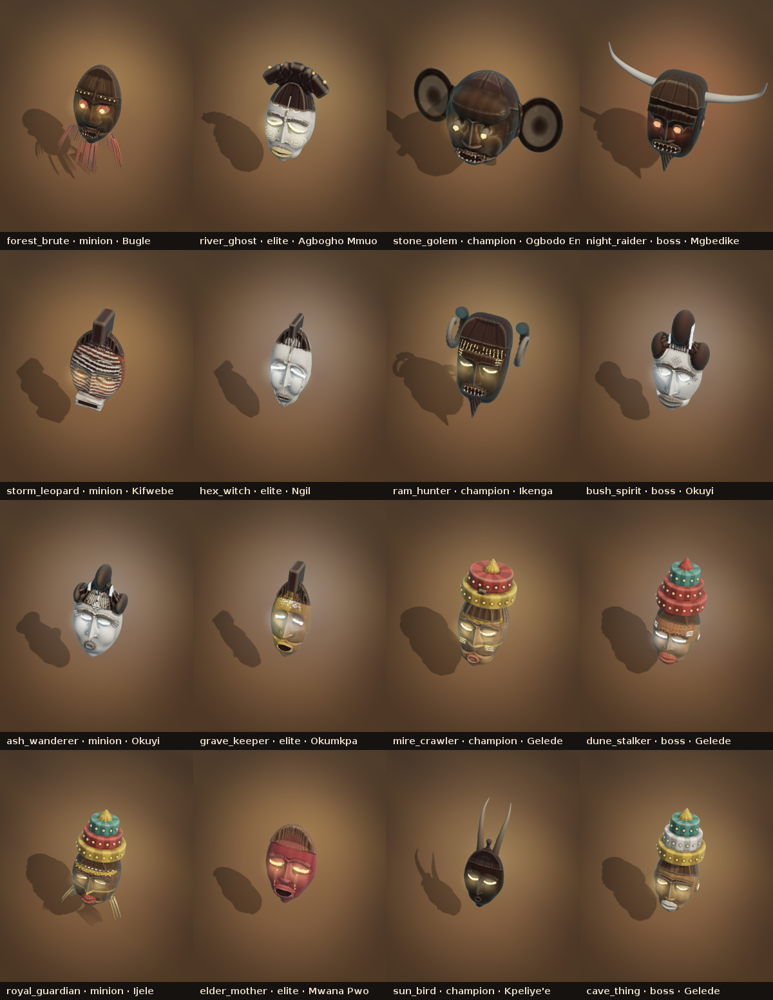
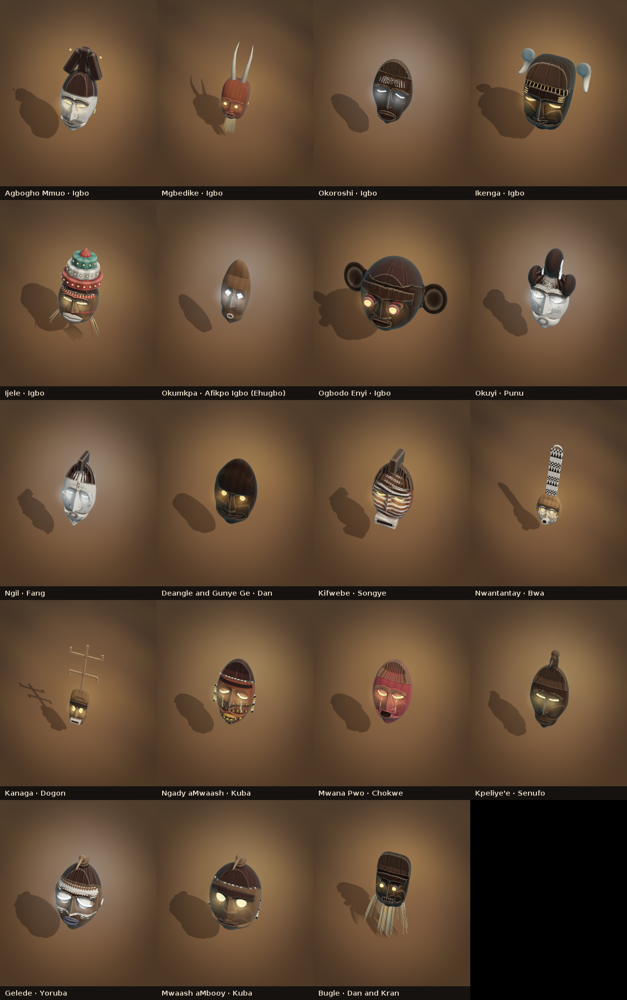

# Carving masks that read as African masks

The sculptor (`engine/model/.../mask/sculpt/MaskSculptor.kt`) carves every
mask as one signed distance field. What decides whether it reads as a carved
African mask or as a toy glued from primitives is a handful of rules, taken
from the pieces themselves (Igbo Agbogho Mmuo, Okoroshi, Mgbedike; Chokwe
Pwo; Dan; Punu; Songye; and the rest of the 19 traditions).

## The rules

1. **One convex form, not a board.** The face is pressed into its planes
   (forehead falling back from the brow, chin falling back below the mouth),
   but that pressing *rolls* into the sides with a smooth blend instead of a
   bevelled rim, and never presses past the middle of the head, so crown and
   chin keep their own round.
2. **Long, narrow faces.** Faces are about two thirds as wide as they are
   tall, taper to a small firm chin and dome above the brow.
3. **Masses first, then detail.** The big masses (the eye band, the sockets,
   cheeks, the mouth's mound, the chin, a domed brow, tube eyes) are rounded
   volumes joined with a polynomial smooth minimum, so they flow into each
   other with no seam. Only the detail (lids, lips, teeth, incisions) is cut
   crisp.
4. **The eye band.** One shallow trough runs across both eyes under the brow,
   so the brow overhangs the eyes and the cheeks rise out of it.
5. **Brow and nose are one T.** Arched brows spring from the root of the
   nose; a heavy brow is one sweeping ridge over both eyes, not a ledge. The
   nose grows out of the face with smooth sides, not set on it.
6. **Hair is part of the head.** The coiffure sits flush, pressed back with
   the face, a polished mass with an incised hairline; crests, combs, lobes
   and arched crests rise out of it. Superstructures are seated down over the
   crown.
7. **Paint is graphic, wear is restrained.** Brows are painted dark on a
   whitened face; kaolin chips only on edges and high points, and greys in the
   hollows; adze marks are a whisper.
8. **Ichi flow round the head.** The fine flutes on the brow are cut into the
   head itself, spaced evenly round its curve, so they follow the temples.

New in this round: the arched, knob-studded crests of Agbogho Mmuo
(`Coiffure.ARCHES`), the Gelede, Mwaash aMbooy and Bugle traditions, and
Nsibidi-style incised signs (composed from that script's strokes; they copy no
real glyph and claim no meaning).

## Generated monsters

Every monster wears a carved mask (`CharacterMasks.sculptedFor`): its
tradition chosen from what it is called (a brute is Mgbedike or Bugle, a ghost
or maiden Agbogho Mmuo or Okuyi, a golem the elephant mask), otherwise from a
seed of its id, with bosses and champions drawn from the great masquerades.
The mask is rolled within that tradition's grammar from the same seed, so each
kind of monster always wears the same mask and no two kinds share one; rank
makes the same face grander. A pack's own genome or preset override still
wins. `MaskCharacters.sculptedMonsters = false` returns to the simpler genome
masks.

## Seen in play

The masks move with the game's own motion layers (hover, strike, cast, flinch,
fall), their eyes and lines lit by what they are doing; see the looping
`screenshots/sculpted-masks/sculpt-anim-*.gif`.

## Regenerating

    ./gradlew :tools:artpreview:maskSpiritPreview -Pout=docs/screenshots/sculpted-masks -Ponly=sculpt
    ./gradlew :tools:artpreview:maskSpiritPreview -Pout=docs/screenshots/carved-wood -Ponly=wood
    ./gradlew :tools:artpreview:maskSpiritPreview -Pout=docs/screenshots/mask-carver -Ponly=carver
    ./gradlew :tools:artpreview:maskSpiritPreview -Pout=docs/screenshots/sculpted-masks -Ponly=monsters
